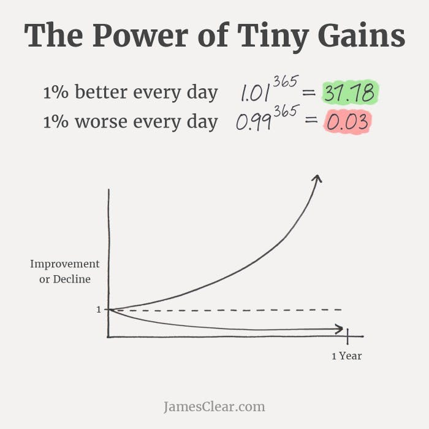

“Most people overestimate what they can achieve in a year and underestimate what they can achieve in ten years.” - Bill Gates  

“大多数人高估了他们在一年内能取得的成就，低估了他们在十年内能取得的成就。”

With all due respect to Bill, I'd like to propose an edit:  

恕我直言，我想提出一个编辑：

“Most people overestimate what they can achieve in a **DAY** and underestimate what they can achieve in a **YEAR**.”  

“大多数人高估了他们在一天内能取得的成就，低估了他们在一年内能取得的成就。

I don't know about you, but I find the idea of ten years wildly intimidating. I'm 31, so maybe it's just the fact that ten years represents one third of my life, or maybe it's my silent understanding that ten years ago I was doing embarrassingly immature stuff on a regular basis. Whatever the reason, I have a very tough time thinking on a ten year time horizon.  

我不了解你，但我发现十年的想法非常令人生畏。我今年31岁，所以也许只是十年代表了我生命的三分之一，或者也许是我默默地理解十年前我经常做令人尴尬的不成熟的事情。不管是什么原因，我很难在十年的时间范围内思考。

What's more, I think its completely unnecessary!  

更重要的是，我认为这完全没有必要！

You don't need ten years to accomplish something spectacular. You don't need five years. You don't even need three years.  

你不需要十年就能完成一些壮观的事情。你不需要五年。你甚至不需要三年。

The truth: The massive, positive change you're hoping to make in your life is always just one year away.  

真相：你希望在生活中做出的巨大而积极的改变只需要一年的时间。

I don't say this in a cliche, self help, "you can do anything you set your mind to!" manner. I say it in the literal, tactical, "here's _exactly_ how to lock in and make the change!" manner that I hope you've all come to expect from me and my writing.  

我不是用陈词滥调的自助方式说这句话，“你可以做任何你想做的事情！”的方式。我用字面上的战术说，“这正是锁定和做出改变的方法！”我希望你们都对我和我的写作有所期待。

So with that as context, let's talk about how to change your life in just one year...  

因此，以此为背景，让我们谈谈如何在短短一年内改变您的生活......

## A Brief Personal Story 一个简短的个人故事

I started thinking about the power of one year for a very specific reason.  

我开始思考一年的力量是出于一个非常具体的原因。

On September 10, 2021, my wife surprised me with the news that she was pregnant.  

2021 年 9 月 10 日，我的妻子怀孕的消息让我感到惊讶。

> One year ago, my wife surprised me with the news that she was pregnant.  
> 
> 一年前，我的妻子怀孕的消息让我感到惊讶。
> 
> We hadn’t been sure we would be able to conceive naturally, so the raw emotion and surprise of the moment poured out of me.
> 
>   
> 
> 我们不确定我们是否能够自然受孕，所以那一刻的原始情感和惊喜从我身上倾泻而出。
> 
> Yet another reminder that your entire world can change in a year. 
> 
> 再次提醒我们，你的整个世界可能会在一年内发生变化。

Like many people out there, most of whom suffer in silence, we had been uncertain as to whether we would be able to conceive naturally. As you can see in the video, the surprise and joy of the moment poured out of me uncontrollably.  

像外面的许多人一样，他们中的大多数人都在默默地受苦，我们一直不确定我们是否能够自然受孕。正如你在视频中看到的那样，那一刻的惊喜和喜悦不受控制地从我身上涌出。

Fast forward one year, and my world looks very different...  

快进一年，我的世界看起来非常不同......

I took a long walk on the one year anniversary and reflected on my emotions and learnings from the year that was.  

在一周年纪念日，我走了很长一段路，反思了我那一年的情绪和学习。

What I kept coming back to: The idea of _something from nothing_.  

我一直在回想：从无到有的想法。

An entire life was created from nothing in the span of a single year. What started as a nothing—a few cells and a line on a testing device—has become a babbling, head-wobbling something.  

整个生命是在一年的时间里从无到有创造的。一开始一无所有的东西——测试设备上的几个细胞和一条线——已经变成了一个咿咿呀呀、摇头晃动的东西。

It made me think: If an entire life can be created in a single year, what other massive changes are we all capable of making in that same, seemingly short time horizon?  

这让我思考：如果整个生命可以在一年内创造，那么在同样看似短暂的时间范围内，我们还能做出哪些巨大的改变？

## A Year of Possibilities 充满可能性的一年

Kaizen is a Japanese word meaning improvement. In practice, the term is used to convey continuous improvement.  

改善是一个日语单词，意思是改进。在实践中，该术语用于传达持续改进。

The concept of Kaizen began to build a mainstream following with the works of Masaaki Imai, a Japanese organizational theorist and consultant.  

Kaizen的概念随着日本组织理论家和顾问Masaaki Imai的作品开始建立主流追随者。

In 1986, he published a best-seller, entitled "Kaizen: The Key to Japan’s Competitive Success” and founded The Kaizen Institute.  

1986年，他出版了一本畅销书《改善：日本竞争成功的关键》，并创立了改善研究所。

Kaizen prioritizes a focus on small, daily improvements, rather than large, step-function leaps. It teaches that progress and growth are the result of daily actions to drive the small improvements.  

Kaizen优先考虑小的日常改进，而不是大的阶梯功能飞跃。它教导人们，进步和成长是推动小改进的日常行动的结果。

James Clear has a brilliant visualization of the impact of continuous improvement:  

James Clear 对持续改进的影响进行了精彩的可视化：

There are a two key takeaways from this image:  

这张图片有两个关键要点：

1.  Compounding is Magic: 1% daily improvements for an entire year will result in a ~38x improvement by the end of the period. This is one of those "a-ha!" moments on the power of compounding. My other favorite is that if you invest $1,000 and generate a 15% annual return, you'll have $1,000,000 after 50 years.  
    
    复利是魔术：全年每天 1% 的改进将导致 ~38 倍的改进到期末。这是关于复利力量的“啊哈！”时刻之一。我最喜欢的另一个是，如果你投资1000美元并产生15%的年回报，那么50年后你将有100万美元。
2.  Compounding is a Double-Edged Sword: Compounding cuts both ways. If you get 1% worse each day, you're going to be in a lot of trouble after one year.  
    
    复利是一把双刃剑：复利是双向的。如果你每天恶化1%，一年后你会遇到很多麻烦。

The conclusion is that dramatic change is possible in one year through making consistent, tiny daily improvements.  

结论是，通过每天进行一致的微小改进，在一年内可能会发生巨大的变化。

Ok, but how do we get started on a path of continuous improvement?  

好的，但是我们如何开始走上持续改进的道路呢？

## How to Make Continuous Improvements  

如何进行持续改进

My framework for continuous improvement is four steps:  

我的持续改进框架是四个步骤：

### Step 1: Establish the Desire  

第 1 步：建立愿望

The first step towards continuous improvement is establishing a desire to make the improvement.  

持续改进的第一步是建立进行改进的愿望。

I deeply believe that 90% of becoming great at something is just really wanting to be great at it. When you have the desire to make progress at something, you'll find the energy and motivation to make it happen.  

我深信，90%的在某件事上变得伟大只是真的想做得很好。当你渴望在某件事上取得进步时，你会找到实现它的能量和动力。

When you're getting started, write down exactly what you want to do. Be specific about your desires. Put this in a place where you can see it—it helps with vision.  

当你开始的时候，准确地写下你想做什么。具体说明你的愿望。把它放在你可以看到的地方——它有助于视力。

### Step 2: Plan 第 2 步：计划

With your desire established in Step 1, create your plan in Step 2.  

在步骤 1 中建立您的愿望后，在步骤 2 中创建您的计划。

My core belief is that consistent, continuous improvement requires consistent, continuous action. For me, this means that if I want to improve at something, I will do that something every single day.  

我的核心信念是，持续不断的改进需要一致、持续的行动。对我来说，这意味着如果我想在某件事上有所改进，我每天都会这样做。

It sounds so simple, but it just plain works:  

这听起来很简单，但它只是简单的工作：

-   If you want to improve your cardiovascular health, do some form of cardio training, every single day.  
    
    如果您想改善心血管健康，请每天进行某种形式的有氧训练。
-   If you want to improve your writing, write, every single day.  
    
    如果你想提高你的写作水平，那就每天写作。
-   If you want to improve your thinking, read, every single day.  
    
    如果你想改善你的思维，每天阅读。
-   If you want to improve your relationships, spend time being present with those people, every single day.  
    
    如果你想改善你的人际关系，每天花时间和这些人在一起。

Your plan should be brutally, painfully simple.  

你的计划应该是残酷的，痛苦的简单。

What are the 2-3 daily actions that you would need to take to create tangible, compounding progress in your area of choice? These should be the SIMPLEST daily actions.  

您需要采取哪些 2-3 个日常行动才能在您选择的领域创造切实的复合进展？这些应该是最简单的日常行动。

### Step 3: Execute 步骤 3：执行

There are two paths to choose from to execute:  

有两种路径可供选择来执行：

1.  30-for-30: My [30-for-30 approach](https://www.sahilbloom.com/newsletter/the-30-for-30-challenge) is very simple: Do the daily action for 30 minutes per day for 30 straight days. 30 days is meaningful enough as a commitment that you can't be half-in, but 30 minutes is short enough that you can convince yourself to take it on. 900 minutes of effort in a single month is enough to create tangible progress that will keep you pushing forward. This is my favored approach for getting started on any new area of progress.  
    
    30对30：我的30对30方法非常简单：连续30天每天做30分钟的日常行动。30天作为一个承诺足够有意义，你不能半途而废，但30分钟足够短，你可以说服自己承担它。在一个月内付出900分钟的努力足以创造切实的进步，让你不断前进。这是我最喜欢的开始任何新进展领域的方法。
2.  Deep Work: Deep work means carving out 1-2 blocks of time per day when you will enter a deeply focused state to make progress against your area of choice. These blocks are generally 1-2 hours for most people and should be completed without distraction. This is the favored strategy for big professional goals, which often require more time and focused energy, but it can feel intimidating given the requirements. Note: Cal Newport's book on this is [great](https://www.amazon.com/Deep-Work-Focused-Success-Distracted/dp/1455586692).  
    
    深度工作：深度工作意味着每天挤出 1-2 个时间段，此时您将进入深度专注状态，以便在您选择的领域取得进展。对于大多数人来说，这些块通常是 1-2 小时，应该在不分心的情况下完成。这是大职业目标的首选策略，这通常需要更多的时间和集中的精力，但考虑到要求，它可能会让人感到害怕。注意：Cal Newport关于这一点的书很棒。

My recommendation: Start with 30-for-30 and then transition to Deep Work after a few months if you feel motivated and energized to go harder.  

我的建议是：从30对30开始，然后在几个月后过渡到深度工作，如果你有动力和精力去更努力。

### Step 4: Track & Adjust  

第 4 步：跟踪和调整

Your execution has to be trackable and adjustable.  

您的执行必须是可跟踪和可调整的。

Jerry Seinfeld would famously hang a huge calendar on his office wall and use a red marker to put an X over every day that he completed an hour of writing. It wasn't about the writing being good, it was simply about the daily action.  

杰里·宋飞（Jerry Seinfeld）会在办公室的墙上挂一个巨大的日历，并在他完成一小时写作的每一天用红色记号笔在上面打一个X。这不是关于写作好坏，而只是关于日常行动。

Leverage community to hold you accountable on your journey. There’s nothing more powerful than community when it comes to goal setting and achievement. Create a Google Sheet and track your process goals with others. Forced accountability is a powerful weapon in your arsenal!  

利用社区让您在旅途中承担责任。在目标设定和成就方面，没有什么比社区更强大的了。创建 Google 表格并与他人一起跟踪您的流程目标。强制问责是你武器库中的有力武器！

Avoid becoming dogmatic—allow yourself to adjust as needed along the way. A few common adjustments that you may find useful:  

避免变得教条——让自己在此过程中根据需要进行调整。您可能会发现一些有用的常见调整：

-   Downward Adjustments: Overly-ambitious daily process goals should be adjusted down. Set them to be overly-achievable. The human psyche responds well to wins—manufacture them early and benefit later.  
    
    向下调整：过于雄心勃勃的日常流程目标应向下调整。将它们设置为过度可实现。人类的心理对胜利反应良好——尽早制造胜利，以后受益。
-   Environmental Adjustments: Environments that are unsuited to achieving daily process goals should be adjusted. If my daily process goal is to eat a balanced, nutrient-dense breakfast, a kitchen full of junk is an environment unsuited to my goal. Deliberately adjust your environments to match your goals.  
    
    环境调整：应调整不适合实现日常过程目标的环境。如果我的日常流程目标是吃均衡、营养丰富的早餐，那么充满垃圾的厨房就是一个不适合我目标的环境。有意识地调整您的环境以匹配您的目标。

The goals we track and adjust are the goals we achieve.  

我们跟踪和调整的目标就是我们实现的目标。

## How to Stay the Course  

如何坚持到底

One observation I've had on my own journey: It's often very difficult to see and feel progress in the moment.  

我在自己的旅程中观察到的一个结果是：通常很难看到和感受到当下的进步。

This is the leading cause of lost motivation, habit reversion, and stalled progress.  

这是失去动力、习惯逆转和进展停滞的主要原因。

When we fail to see and feel our progress, we lose hope. We start to experience the negative internal feedback loop. It usually sounds something like this:  

当我们看不到和感受不到我们的进步时，我们就失去了希望。我们开始经历负面的内部反馈循环。通常听起来像这样：

"I'm not making any progress. Why am I not making any progress? Probably because I'm not smart or talented, so I was never going to make progress. Why am I doing all of these things every single day if I'm never going to make progress? This is stupid. I'm going to stop."  

“我没有取得任何进展。为什么我没有取得任何进展？可能是因为我不聪明，也不有才华，所以我永远不会进步。如果我永远无法取得进步，为什么我每天都要做所有这些事情？这是愚蠢的。我要停下来。

The problem is that this is all about perception vs. reality. If you are taking the right daily actions (and refining them as needed), you are making progress (reality), it's just hard to see it sometimes (perception).  

问题在于，这完全是关于感知与现实的。如果你正在采取正确的日常行动（并根据需要改进它们），你正在取得进展（现实），有时很难看到它（感知）。

Three ways to fight back and stay the course:  

反击并坚持到底的三种方法：

### Zoom Out 缩小

Remember this mantra: When in doubt, zoom out.  

记住这个口头禅：如有疑问，请缩小。

Life is a first person game. You live zoomed in. The issue with this is that the zoomed in view fails to provide perspective on where you started, where you are, and where you're heading.  

生活是第一人称游戏。你活放大了。这样做的问题是，放大的视图无法提供关于您开始的位置、您所在的位置以及您要前进的方向的视角。

When we lose sight of the delta between where we started and where we are, we fail to appreciate the progress and growth our actions have created.  

当我们忽视了我们开始的地方和我们所处的位置之间的差距时，我们就无法欣赏我们的行动所创造的进步和增长。

Zooming out is your first line of defense for staying the course.  

缩小是你坚持到底的第一道防线。

_Action Item: Set a weekly reminder to look back at your starting level and compare it to your current level. Doing this weekly will keep you on track.  

行动项目：设置每周提醒，回顾您的起始级别并将其与当前级别进行比较。每周这样做会让你走上正轨。_

### Micro Rewards 微奖励

Give yourself micro rewards for completing the process.  

给自己完成这个过程的微奖励。

We often fail to incentivize process, instead focusing all incentives on actual goal achivement. This is the wrong way to go about it.  

我们往往无法激励过程，而是将所有激励都集中在实际目标实现上。这是错误的方法。

Start incentivizing your completion of the daily actions that will contribute to the long-term achievement.  

开始激励你完成有助于长期成就的日常行动。

_Action Item: Establish a weekly micro reward (one that doesn't set you back from your core goals). Write it up on your screen or whiteboard so that you know what you can look forward to if you stick to your plan.  

行动项目：建立每周一次的微奖励（不会让你偏离核心目标的奖励）。把它写在你的屏幕或白板上，这样你就知道如果你坚持你的计划，你可以期待什么。_

### Look Back & Cringe 回顾和畏缩

My favorite strategy for staying the course: Review some of your old work and cringe at how bad it is!  

我最喜欢的坚持到底的策略是：回顾你的一些旧作品，并对它有多糟糕感到畏缩！

As discussed around the zoom out strategy, it's easy to lose sight of the progress you're making when you're living in the moment. Reviewing old work in detail is a good way to force the progress to the top of your mind.  

正如围绕缩小策略所讨论的那样，当你活在当下时，很容易忽视你正在取得的进展。详细回顾旧工作是将进度放在首位的好方法。

If you're trying to become a world class writer, go look at some of your writing from 6 months ago. Assuming you've been writing every day since then, you can safely assume that the old writing will make you cringe at how bad it seems.  

如果你想成为一名世界级的作家，去看看你6个月前的一些作品。假设从那以后你每天都在写作，你可以放心地假设旧写作会让你对它看起来有多糟糕感到畏缩。

That's growth! 这就是成长！

_Action Item: Establish a monthly cadence to review your old work. Embrace the cringe.  

行动项目：建立每月一次的节奏来回顾你的旧工作。拥抱畏缩。_

## Conclusion 结论

I am consistently blown away by the change that is possible in a single year.  

我一直被一年内可能出现的变化所震撼。

In one year, you can:  

在一年内，您可以：

-   Build and scale a solo business. Build a relevant audience of 10K+ around your topic of interest, create landing pages for services you plan to offer to that audience, and monetize your services.  
    
    建立和扩展个人业务。围绕您感兴趣的主题建立 10K+ 的相关受众，为您计划向该受众提供的服务创建登录页面，并通过您的服务获利。
-   Dramatically improve your health and vitality. Lose weight, build muscle, improve your performance, and extend your lifespan.  
    
    显著改善您的健康和活力。减肥，锻炼肌肉，提高表现，延长寿命。
-   Get that promotion you've been dreaming of. Pay off the debt that has been hanging over your head. Set yourself and your family on a better financial course.  
    
    获得您梦寐以求的促销活动。还清一直悬在你头上的债务。让自己和家人走上更好的财务道路。
-   Read 50+ books. Build a scale newsletter around a topic of interest. Launch and scale a top podcast.  
    
    阅读50+本书。围绕感兴趣的主题构建规模新闻稿。启动并扩展顶级播客。

The possibilities are—quite literally—endless.  

从字面上看，可能性是无穷无尽的。

By leveraging the strategies discussed in this piece, you will put yourself on the path to creating continuous improvement and staying the course through the challenges along the way.  

通过利用本文中讨论的策略，您将走上实现持续改进的道路，并在此过程中坚持挑战。

Don't wait for the new calendar year to get started. Maybe the best time to start something was January 1, but the second best time is TODAY.  

不要等到新的日历年开始。也许开始某件事的最佳时间是 1 月 1 日，但第二好的时间是今天。

I'd love to hear from you:  

我很想听听你的意见：

-   What do you plan to focus on for the year ahead?  
    
    您计划在未来一年关注什么？
-   What change do you want to create in your life?  
    
    你想在你的生活中创造什么改变？
-   How will this change impact your life for the better?  
    
    这种变化将如何影响您的生活变得更好？

Reply to this email or tweet at me @SahilBloom and I'll do my best to get back to everyone!  

@SahilBloom回复这封电子邮件或发推文，我会尽我所能回复大家！

_Oh, and I'll leave you with a picture to give you a good, hearty laugh—a still shot of my face when I found out about the baby news...  

哦，我会给你留一张照片，给你一个愉快的、爽朗的笑声——当我发现婴儿的消息时，我的脸的静止镜头......

That feeling when you know your whole life just changed  

当你知道你的整个生活都改变了时的感觉

