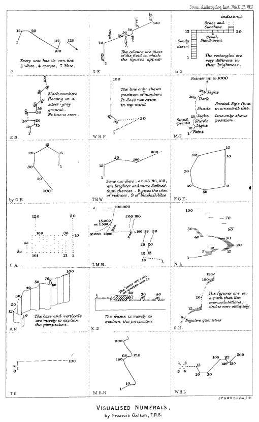
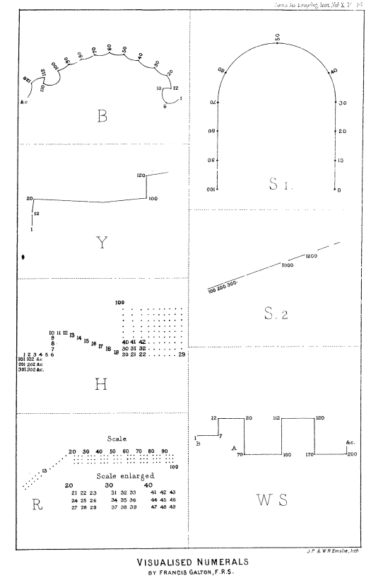
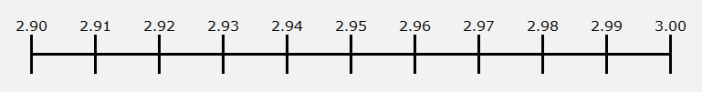
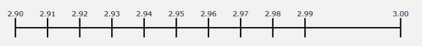
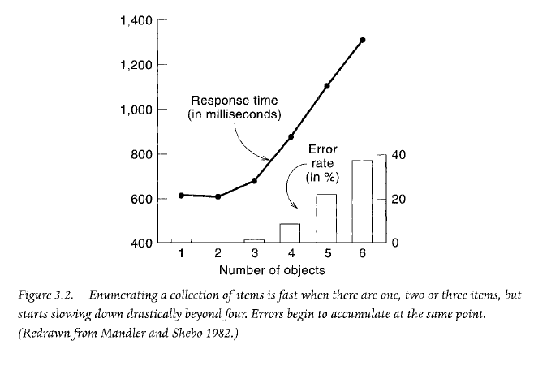
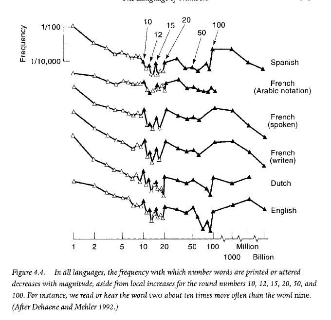
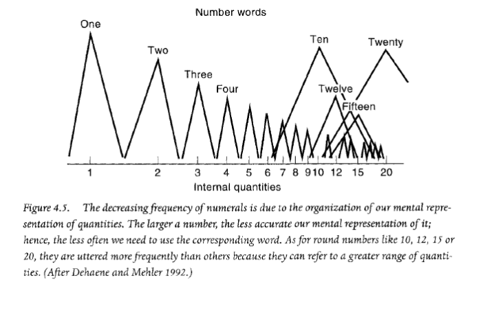

I once worked at a company that priced everything with a .95 ending. The bestselling software package was $999.95. Add-on products were $9.95, or $19.95, or $49.95. Everything ended with a .95. It had been this way for more than twenty years.  

我曾在一家公司工作过，该公司对所有产品的定价都以 .95 结尾。最畅销的软件包售价为 999.95 美元。附加产品是 9.95 美元、19.95 美元或 49.95 美元。所有产品都以 .95 结尾。二十多年来一直如此。

One day, one of the VPs suggested we change all prices to end in .99. The rationale was that raising prices from .95-endings to .99-endings would net an extra four cents for every transaction.  

有一天，一位副总裁建议我们将所有价格改为以 .99 结尾。理由是，把价格从 0.95 结尾改为 0.99 结尾，每笔交易就能多赚 4 美分。

But would that really happen? According to traditional economics, no. That’s because traditional economics predicts that raising a price results in fewer units—and fewer units, even at a higher price, means less revenue.  

但这真的会发生吗？根据传统经济学，不会。这是因为传统经济学预测，提高价格会导致单位数量减少，而单位数量减少，即使价格提高，也意味着收入减少。

Flash forward a few years. Different company, same question. We’re sitting around a conference table discussing pricing strategy for an upcoming product. The VP leading the meeting smacks our competitor’s catalog onto the table. As we review our competitor’s products, we notice they price some of their products with .99-endings and others with .00-endings.  

转眼几年过去了。不同的公司，同样的问题。我们正围坐在会议桌前讨论即将推出的产品的定价策略。主持会议的副总裁把我们竞争对手的产品目录拍到了桌子上。当我们查看竞争对手的产品时，我们注意到他们有些产品的定价以 .99 结尾，有些则以 .00 结尾。

Why? Did they know something we didn’t? Do .99-ending prices make more money—but only some of the time?  

为什么？他们知道我们不知道的事情吗？99 折的价格能赚更多的钱吗？

To answer these questions, we need to take a deep dive into how the mind perceives numbers—and how that affects consumer behavior.  

要回答这些问题，我们需要深入研究大脑是如何感知数字的，以及数字是如何影响消费者行为的。

## 3 ways .99-ending prices affect your spending habits  

3 种影响您消费习惯的方式

### 1\. .99-ending prices make you spend more money  

1\. .99-ending 价格让你花更多的钱

In one of the [first-ever studies on 9-ending prices](http://web.mit.edu/simester/Public/Papers/Effectsof$9.pdf), a national mail order company sent out their catalog to three group of people. Each group got a slightly different version of the catalog.  

在一项关于 9 折价格的首次研究中，一家全国性邮购公司向三组人发送了他们的商品目录。每组收到的目录版本略有不同。

1.  The first group saw 9-ending prices for the four dresses, such as $39.  
    
    第一组看到四款裙子的价格都是 9 折，比如 39 美元。
2.  The second group saw prices that were $5 more—$44 instead of $39.  
    
    第二组人看到的价格则高出 5 美元--44 美元而不是 39 美元。
3.  The third group saw prices that were $5 _less_—or $34 instead of $39.  
    
    第三组看到的价格则低 5 美元，即 34 美元而不是 39 美元。

These tests were run with four dresses at four prices: $39, $49, $59, $69.  

这些测试使用了四种价格的四款连衣裙：39 美元、49 美元、59 美元和 69 美元。

The group that saw the 9-ending prices purchase more dresses and spent more money. The 9-ending prices earned 48% more revenue over prices that were $5 _more_, and 53% more revenue over prices that were $5 _less_.  

看到 9 折价格的一组购买了更多的裙子，花了更多的钱。9 折价格比多 5 美元的价格多赚了 48%，比少 5 美元的价格多赚了 53%。

<table data-immersive-translate-walked="139cf79f-7c3d-4f1d-896d-a619db442d47"><tbody data-immersive-translate-walked="139cf79f-7c3d-4f1d-896d-a619db442d47"><tr data-immersive-translate-walked="139cf79f-7c3d-4f1d-896d-a619db442d47"><td><strong>Prices</strong></td><td data-immersive-translate-walked="139cf79f-7c3d-4f1d-896d-a619db442d47"></td><td data-immersive-translate-walked="139cf79f-7c3d-4f1d-896d-a619db442d47"></td><td data-immersive-translate-walked="139cf79f-7c3d-4f1d-896d-a619db442d47"></td></tr><tr data-immersive-translate-walked="139cf79f-7c3d-4f1d-896d-a619db442d47"><td><strong>Item</strong></td><td data-immersive-translate-walked="139cf79f-7c3d-4f1d-896d-a619db442d47"><strong data-immersive-translate-walked="139cf79f-7c3d-4f1d-896d-a619db442d47" data-immersive-translate-paragraph="1">9-ending prices&nbsp;9 结束价格</strong></td><td data-immersive-translate-walked="139cf79f-7c3d-4f1d-896d-a619db442d47"><strong data-immersive-translate-walked="139cf79f-7c3d-4f1d-896d-a619db442d47" data-immersive-translate-paragraph="1">$5 less&nbsp;少 5 美元</strong></td><td data-immersive-translate-walked="139cf79f-7c3d-4f1d-896d-a619db442d47"><strong data-immersive-translate-walked="139cf79f-7c3d-4f1d-896d-a619db442d47" data-immersive-translate-paragraph="1">$5 more&nbsp;5美元</strong></td></tr><tr data-immersive-translate-walked="139cf79f-7c3d-4f1d-896d-a619db442d47"><td data-immersive-translate-walked="139cf79f-7c3d-4f1d-896d-a619db442d47" data-immersive-translate-paragraph="1">Dress #1&nbsp;礼服 #1</td><td data-immersive-translate-walked="139cf79f-7c3d-4f1d-896d-a619db442d47">&nbsp;$ 39.00</td><td data-immersive-translate-walked="139cf79f-7c3d-4f1d-896d-a619db442d47">&nbsp;$&nbsp;&nbsp;&nbsp; 34.00</td><td data-immersive-translate-walked="139cf79f-7c3d-4f1d-896d-a619db442d47">&nbsp;$&nbsp;&nbsp;&nbsp; 44.00</td></tr><tr data-immersive-translate-walked="139cf79f-7c3d-4f1d-896d-a619db442d47"><td data-immersive-translate-walked="139cf79f-7c3d-4f1d-896d-a619db442d47" data-immersive-translate-paragraph="1">Dress #2&nbsp;礼服 #2</td><td data-immersive-translate-walked="139cf79f-7c3d-4f1d-896d-a619db442d47">&nbsp;$ 49.00</td><td data-immersive-translate-walked="139cf79f-7c3d-4f1d-896d-a619db442d47">&nbsp;$&nbsp;&nbsp;&nbsp; 44.00</td><td data-immersive-translate-walked="139cf79f-7c3d-4f1d-896d-a619db442d47">&nbsp;$&nbsp;&nbsp;&nbsp; 54.00</td></tr><tr data-immersive-translate-walked="139cf79f-7c3d-4f1d-896d-a619db442d47"><td data-immersive-translate-walked="139cf79f-7c3d-4f1d-896d-a619db442d47" data-immersive-translate-paragraph="1">Dress #3&nbsp;3 号礼服</td><td data-immersive-translate-walked="139cf79f-7c3d-4f1d-896d-a619db442d47">&nbsp;$ 59.00</td><td data-immersive-translate-walked="139cf79f-7c3d-4f1d-896d-a619db442d47">&nbsp;$&nbsp;&nbsp;&nbsp; 54.00</td><td data-immersive-translate-walked="139cf79f-7c3d-4f1d-896d-a619db442d47">&nbsp;$&nbsp;&nbsp;&nbsp; 64.00</td></tr><tr data-immersive-translate-walked="139cf79f-7c3d-4f1d-896d-a619db442d47"><td data-immersive-translate-walked="139cf79f-7c3d-4f1d-896d-a619db442d47" data-immersive-translate-paragraph="1">Dress #4&nbsp;4 号礼服</td><td data-immersive-translate-walked="139cf79f-7c3d-4f1d-896d-a619db442d47">&nbsp;$ 79.00</td><td data-immersive-translate-walked="139cf79f-7c3d-4f1d-896d-a619db442d47">&nbsp;$&nbsp;&nbsp;&nbsp; 74.00</td><td data-immersive-translate-walked="139cf79f-7c3d-4f1d-896d-a619db442d47">&nbsp;$&nbsp;&nbsp;&nbsp; 84.00</td></tr></tbody></table>

<table data-immersive-translate-walked="139cf79f-7c3d-4f1d-896d-a619db442d47"><tbody data-immersive-translate-walked="139cf79f-7c3d-4f1d-896d-a619db442d47"><tr data-immersive-translate-walked="139cf79f-7c3d-4f1d-896d-a619db442d47"><td data-immersive-translate-walked="139cf79f-7c3d-4f1d-896d-a619db442d47"><strong data-immersive-translate-walked="139cf79f-7c3d-4f1d-896d-a619db442d47" data-immersive-translate-paragraph="1">Units purchased&nbsp;购买单位</strong></td><td data-immersive-translate-walked="139cf79f-7c3d-4f1d-896d-a619db442d47"></td><td data-immersive-translate-walked="139cf79f-7c3d-4f1d-896d-a619db442d47"></td><td data-immersive-translate-walked="139cf79f-7c3d-4f1d-896d-a619db442d47"></td></tr><tr data-immersive-translate-walked="139cf79f-7c3d-4f1d-896d-a619db442d47"><td><strong>Item</strong></td><td data-immersive-translate-walked="139cf79f-7c3d-4f1d-896d-a619db442d47"><strong data-immersive-translate-walked="139cf79f-7c3d-4f1d-896d-a619db442d47" data-immersive-translate-paragraph="1">9-ending prices&nbsp;9 结束价格</strong></td><td data-immersive-translate-walked="139cf79f-7c3d-4f1d-896d-a619db442d47"><strong data-immersive-translate-walked="139cf79f-7c3d-4f1d-896d-a619db442d47" data-immersive-translate-paragraph="1">$5 less&nbsp;少 5 美元</strong></td><td data-immersive-translate-walked="139cf79f-7c3d-4f1d-896d-a619db442d47"><strong data-immersive-translate-walked="139cf79f-7c3d-4f1d-896d-a619db442d47" data-immersive-translate-paragraph="1">$5 more&nbsp;5美元</strong></td></tr><tr data-immersive-translate-walked="139cf79f-7c3d-4f1d-896d-a619db442d47"><td data-immersive-translate-walked="139cf79f-7c3d-4f1d-896d-a619db442d47" data-immersive-translate-paragraph="1">Dress #1&nbsp;礼服 #1</td><td>21</td><td>16</td><td>17</td></tr><tr data-immersive-translate-walked="139cf79f-7c3d-4f1d-896d-a619db442d47"><td data-immersive-translate-walked="139cf79f-7c3d-4f1d-896d-a619db442d47" data-immersive-translate-paragraph="1">Dress #2&nbsp;礼服 #2</td><td>14</td><td>8</td><td>10</td></tr><tr data-immersive-translate-walked="139cf79f-7c3d-4f1d-896d-a619db442d47"><td data-immersive-translate-walked="139cf79f-7c3d-4f1d-896d-a619db442d47" data-immersive-translate-paragraph="1">Dress #3&nbsp;3 号礼服</td><td>7</td><td>7</td><td>6</td></tr><tr data-immersive-translate-walked="139cf79f-7c3d-4f1d-896d-a619db442d47"><td data-immersive-translate-walked="139cf79f-7c3d-4f1d-896d-a619db442d47" data-immersive-translate-paragraph="1">Dress #4&nbsp;4 号礼服</td><td>24</td><td>12</td><td>15</td></tr><tr data-immersive-translate-walked="139cf79f-7c3d-4f1d-896d-a619db442d47"><td>TOTAL</td><td>66</td><td>43</td><td>48</td></tr></tbody></table>

<table data-immersive-translate-walked="139cf79f-7c3d-4f1d-896d-a619db442d47"><tbody data-immersive-translate-walked="139cf79f-7c3d-4f1d-896d-a619db442d47"><tr data-immersive-translate-walked="139cf79f-7c3d-4f1d-896d-a619db442d47"><td><strong>Revenue</strong></td><td data-immersive-translate-walked="139cf79f-7c3d-4f1d-896d-a619db442d47"></td><td data-immersive-translate-walked="139cf79f-7c3d-4f1d-896d-a619db442d47"></td><td data-immersive-translate-walked="139cf79f-7c3d-4f1d-896d-a619db442d47"></td></tr><tr data-immersive-translate-walked="139cf79f-7c3d-4f1d-896d-a619db442d47"><td><strong>Item</strong></td><td data-immersive-translate-walked="139cf79f-7c3d-4f1d-896d-a619db442d47"><strong data-immersive-translate-walked="139cf79f-7c3d-4f1d-896d-a619db442d47" data-immersive-translate-paragraph="1">9-ending prices&nbsp;9 结束价格</strong></td><td data-immersive-translate-walked="139cf79f-7c3d-4f1d-896d-a619db442d47"><strong data-immersive-translate-walked="139cf79f-7c3d-4f1d-896d-a619db442d47" data-immersive-translate-paragraph="1">$5 less&nbsp;少 5 美元</strong></td><td data-immersive-translate-walked="139cf79f-7c3d-4f1d-896d-a619db442d47"><strong data-immersive-translate-walked="139cf79f-7c3d-4f1d-896d-a619db442d47" data-immersive-translate-paragraph="1">$5 more&nbsp;5美元</strong></td></tr><tr data-immersive-translate-walked="139cf79f-7c3d-4f1d-896d-a619db442d47"><td data-immersive-translate-walked="139cf79f-7c3d-4f1d-896d-a619db442d47" data-immersive-translate-paragraph="1">Dress #1&nbsp;礼服 #1</td><td data-immersive-translate-walked="139cf79f-7c3d-4f1d-896d-a619db442d47">&nbsp;$ 819.00</td><td data-immersive-translate-walked="139cf79f-7c3d-4f1d-896d-a619db442d47">&nbsp;$748.00</td><td data-immersive-translate-walked="139cf79f-7c3d-4f1d-896d-a619db442d47">&nbsp;$&nbsp;&nbsp;&nbsp;&nbsp; 544.00</td></tr><tr data-immersive-translate-walked="139cf79f-7c3d-4f1d-896d-a619db442d47"><td data-immersive-translate-walked="139cf79f-7c3d-4f1d-896d-a619db442d47" data-immersive-translate-paragraph="1">Dress #2&nbsp;礼服 #2</td><td data-immersive-translate-walked="139cf79f-7c3d-4f1d-896d-a619db442d47">&nbsp;$686.00</td><td data-immersive-translate-walked="139cf79f-7c3d-4f1d-896d-a619db442d47">&nbsp;$352.00</td><td data-immersive-translate-walked="139cf79f-7c3d-4f1d-896d-a619db442d47">&nbsp;$&nbsp;&nbsp;&nbsp;&nbsp; 540.00</td></tr><tr data-immersive-translate-walked="139cf79f-7c3d-4f1d-896d-a619db442d47"><td data-immersive-translate-walked="139cf79f-7c3d-4f1d-896d-a619db442d47" data-immersive-translate-paragraph="1">Dress #3&nbsp;3 号礼服</td><td data-immersive-translate-walked="139cf79f-7c3d-4f1d-896d-a619db442d47">&nbsp;$413.00</td><td data-immersive-translate-walked="139cf79f-7c3d-4f1d-896d-a619db442d47">&nbsp;$ 378.00</td><td data-immersive-translate-walked="139cf79f-7c3d-4f1d-896d-a619db442d47">&nbsp;$&nbsp;&nbsp;&nbsp;&nbsp; 384.00</td></tr><tr data-immersive-translate-walked="139cf79f-7c3d-4f1d-896d-a619db442d47"><td data-immersive-translate-walked="139cf79f-7c3d-4f1d-896d-a619db442d47" data-immersive-translate-paragraph="1">Dress #4&nbsp;4 号礼服</td><td data-immersive-translate-walked="139cf79f-7c3d-4f1d-896d-a619db442d47">&nbsp;$1,896.00</td><td data-immersive-translate-walked="139cf79f-7c3d-4f1d-896d-a619db442d47">&nbsp;$1,008.00</td><td data-immersive-translate-walked="139cf79f-7c3d-4f1d-896d-a619db442d47">&nbsp;$&nbsp; 1,110.00</td></tr><tr data-immersive-translate-walked="139cf79f-7c3d-4f1d-896d-a619db442d47"><td>TOTAL</td><td data-immersive-translate-walked="139cf79f-7c3d-4f1d-896d-a619db442d47">&nbsp;$3,814.00</td><td data-immersive-translate-walked="139cf79f-7c3d-4f1d-896d-a619db442d47">&nbsp;$2,486.00</td><td data-immersive-translate-walked="139cf79f-7c3d-4f1d-896d-a619db442d47">&nbsp;$&nbsp; 2,578.00</td></tr><tr data-immersive-translate-walked="139cf79f-7c3d-4f1d-896d-a619db442d47"><td data-immersive-translate-walked="139cf79f-7c3d-4f1d-896d-a619db442d47"></td><td data-immersive-translate-walked="139cf79f-7c3d-4f1d-896d-a619db442d47"></td><td data-immersive-translate-walked="139cf79f-7c3d-4f1d-896d-a619db442d47"><strong data-immersive-translate-walked="139cf79f-7c3d-4f1d-896d-a619db442d47" data-immersive-translate-paragraph="1">9-ending: +53%&nbsp;9 结束+53%</strong></td><td data-immersive-translate-walked="139cf79f-7c3d-4f1d-896d-a619db442d47"><strong data-immersive-translate-walked="139cf79f-7c3d-4f1d-896d-a619db442d47" data-immersive-translate-paragraph="1">9-ending: +48%&nbsp;9 结束+48%</strong></td></tr></tbody></table>

**_9-ending prices led to a 48% more revenue, even when the price was higher.  

即使在价格较高的情况下，9 折的价格也能使收入增加 48%。_**

A [second study](https://hbr.org/2003/09/mind-your-pricing-cues) tried the same thing, but with a much larger sample size. In this study, catalogs promoting 169 items were sent to two groups of 45,000 people. One group saw .00-endings and the other group saw .99-endings. **The group that saw the .99-ending prices spent 8% more**.  

第二项研究尝试了同样的方法，但样本量要大得多。在这项研究中，推广 169 种商品的目录被发送给两组 45 000 人。一组人看到的是 .00 底价，另一组人看到的是 .99 底价。看到 .99 底价的那一组人多花了 8%的钱。

### 2\. .99-ending prices make you more likely to spend money  

2\. .99-end 价格让你更愿意花钱

In [another study](http://www.scialert.net/fulltext/?doi=jas.2005.383.384&org=11), conducted in France, researchers watched people buying cheese at a grocery store. They changed the prices of the cheese at 2-hour intervals and watched how people responded. First, they priced cheeses with .99-ending prices. Two hours later, they switched the prices to .00-ending prices.  

在法国进行的另一项研究中，研究人员观察了人们在杂货店购买奶酪的情况。他们每隔 2 小时改变奶酪的价格，并观察人们的反应。首先，他们给奶酪标出了 0.99 的终端价格。两小时后，他们又将价格改为 0.00 元起价。

They ran the experiment for two days. During this time, 241 people bought cheese. When they saw .00-ending prices, they bought cheese 44.1% of the time. But when they saw .99-ending prices, they bought cheese 51.2% of the time.  

他们进行了两天的实验。在此期间，有 241 人购买了奶酪。当他们看到 0.00 的终端价格时，44.1% 的人买了奶酪。但当他们看到 0.99 的终端价格时，51.2%的人买了奶酪。

This study not only confirmed that .99-ending prices lead to more revenue, but they are also more likely to trigger a sale.  

这项研究不仅证实，0.99-终端价格能带来更多收入，而且更有可能引发销售。

That’s not all. Experimenters also learned that the overall transaction amount went up when customers bought cheeses with .99-ending prices. For .00-ending prices, the mean purchase amount was €5.08, but with .99-ending prices, the mean purchase amount was €6.53.  

这还不是全部。实验人员还了解到，当顾客购买.99-结束价格的奶酪时，整体交易额会上升。0.00 结尾价的平均购买金额为 5.08 欧元，而 0.99 结尾价的平均购买金额为 6.53 欧元。

This study revealed that .99-ending prices leads consumers to miscalculate their overall spend.  

这项研究显示，.99-终端价格会导致消费者错误计算其总体消费。

### 3\. .99-ending prices make it harder to keep track of what you spend  

3\. .99-ending 价格使您更难掌握您的花费

In [another study](http://onlinelibrary.wiley.com/doi/10.1002/mar.20084/full), researchers split people into two groups, and gave each group $73 and a list of products to buy.  

在另一项研究中，研究人员将人们分成两组，每组获得 73 美元和一份要购买的产品清单。

The first group saw products with .00-ending prices, such as $3.00. This group bought an average of 23.9 items and spent $71.70 of the $73. They spent _less_ than they intended.  

第一组看到的商品价格以 .00 结尾，如 3.00 美元。这一组平均购买了 23.9 件商品，花费了 73 美元中的 71.70 美元。

But the story was different for the second group. When the researchers dropped prices by one cent—from $3.00 to $2.99, for example—this group bought an average of 25.21 items and spent $75.38.  

但第二组的情况就不同了。当研究人员把价格下降 1 美分--比如从 3 美元降到 2.99 美元--这一组平均购买了 25.21 件商品，花费了 75.38 美元。

**_Dropping the price by one cent led to an increase in sales of 5.1%.  

价格下降 1 美分，销售额增长了 5.1%。_**

The second group, which saw .99-ending prices couldn’t budget as well as the first group. As we’ve seen, .99-ending prices makes it more likely you will spend money _and_ that you will spent more overall. It seems the reason for this is that .99-ending prices cause you to miscalculate how much you’re spending.  

而第二组人看到的是 0.99 的终端价格，他们无法像第一组人那样做好预算。正如我们所看到的，0.99-终端价格使您更有可能花钱，而且您的总体花费会更多。究其原因，似乎是 .99 折的价格会让您错误计算自己的消费金额。

Why are we tricked by .99-ending prices?  

为什么我们会被 0.99 的终结价格所欺骗？

To answer this, we need to understand how your mind perceives and compares numbers.  

要回答这个问题，我们需要了解你的大脑是如何感知和比较数字的。

## When your brain quantifies subjective stimuli, 1 + 3 = 2  

当你的大脑对主观刺激进行量化时，1 + 3 = 2

If you have one light bulb, and you want to double the number of light bulbs, all you need is one more: one plus one equals two.  

如果你有一个灯泡，而你想把灯泡的数量增加一倍，那么你只需要再多一个灯泡：一加一等于二。

Pretty obvious, right? 很明显吧？

Now, let’s say you’ve hung a 15-watt light bulb, and you want the room to be twice as bright. How would you do this?  

现在，假设你挂了一个 15 瓦的灯泡，你想让房间亮两倍。你会怎么做呢？

Well, the easy answer is that you simply add one more light bulb. One 15-watt light bulb plus another 15-watt light bulb gives you 30 watts–a room that’s twice as bright.  

答案很简单，那就是再加一个灯泡。一个 15 瓦的灯泡加上另一个 15 瓦的灯泡，就能产生 30 瓦的功率--房间亮了一倍。

Right? 对不对？

Wrong. 错了

Actually, if you have a 15-watt light bulb, and you want to double the brightness of your room, you would need 60 watts. **You need to _quadruple_ your wattage in order to _double_ your perception of brightness.**  

实际上，如果你有一个 15 瓦的灯泡，而你想把房间的亮度增加一倍，你需要 60 瓦。你需要将瓦特数增加四倍，才能将你感觉到的亮度增加一倍。

(If you’re hanging Christmas lights and want to be twice as bright as your neighbor, then you need to buy four times as many Christmas lights.)  

(如果你挂的圣诞灯想比邻居亮两倍，那么你需要买四倍的圣诞灯）。

This is known as [Steven’s Power Law](https://en.wikipedia.org/wiki/Stevens%27s_power_law), and it predicts how our scales of magnitude differ when we perceive various stimuli. Stevens Power Law says that to double the perception of brightness, add 4 times more wattage.  

这就是史蒂芬幂定律，它预测了我们在感知各种刺激时的量级差异。史蒂芬幂律认为，要使亮度增加一倍，需要增加 4 倍的功率。

This law is true other perceptions, too, but at different constants:  

这一定律在其他感知中也同样适用，只是常数不同而已：

-   To double the perception of sweetness, add 1.7 times more sugar  
    
    要使甜味增加一倍，糖的用量应增加 1.7 倍
-   To double the perception of heaviness, add 1.7 times more weight  
    
    若要将沉重感增加一倍，可增加 1.7 倍的重量
-   To double the perception of shock, add 1.2 times more electricity  
    
    要使震撼感加倍，需要增加 1.2 倍的电量

And it even works for more than just physical stimuli:  

它甚至不仅对身体刺激有效：

-   To double your happiness, you need 4 times more money.  
    
    要想让幸福感翻倍，你需要多花 4 倍的钱。
-   To get a watch twice as nice, you need to spend 8.7 times more.  
    
    要买到两倍漂亮的手表，您需要多花 8.7 倍的钱。
-   To double your social status, you need to earn 2.6 times more money.  
    
    要想社会地位翻番，您需要多赚 2.6 倍的钱。
-   To double the seriousness of theft, you need to steal 60 times more. (If someone steals $100 from you, you’re only half as angry as if they had stolen $6,000 instead.)  
    
    要使偷窃行为的严重性加倍，你需要多偷 60 倍的东西。(如果有人偷了你 100 美元，你的愤怒程度只有他偷了你 6000 美元的一半）。

And, of course, it happens for how you perceive numbers, too. As soon as your mind needs to compute and compare numbers, the scales of magnitude bend and warp, just like they do when you need to quantify changes in physical stimuli.  

当然，你对数字的感知也是如此。只要你的大脑需要计算和比较数字，量级就会弯曲和扭曲，就像你需要量化物理刺激的变化一样。

## How your mind perceives numbers  

你的大脑如何感知数字

Your mind doesn’t process numbers on a neat, objective scale.  

你的大脑不会按照整齐、客观的尺度来处理数字。

Just like doubling the wattage of your light bulbs doesn’t double the perception of brightness, doubling the number doesn’t necessarily mean doubling your perception of twice-as-much.  

就像把灯泡的瓦数增加一倍并不会让人感觉亮度增加一倍一样，数字增加一倍也不一定意味着你感觉亮度增加了一倍。

Sometimes it takes more. Sometimes less.  

有时需要更多。有时需要更少。

That’s because your brain processes numbers on an internal, subjective scale that bends and warps. Most people have in their minds a visual number scale; it’s likely you do, too.  

这是因为你的大脑是根据内部的主观尺度来处理数字的，而这个尺度会弯曲和变形。大多数人的大脑中都有一个可视化的数字刻度，你很可能也有。

More than a century ago, Francis Galton [attempted to draw the ways people view numbers](http://galton.org/essays/1880-1889/galton-1881-jaigi-visualised-numerals.pdf). Here is what he found:  

一个多世纪前，弗朗西斯-高尔顿试图描绘人们看待数字的方式。以下是他的发现：

 

Some numbers lie in rows or blocks. Others are in three dimensions. One person’s visualization even looks like a clock for the numbers one through twelve, and then as the numbers increase beyond twelve they arc to the left, before turning clockwise again for numbers 101 through 112.  

有些数字成行或成块。其他数字则是三维的。有一个人的视觉效果甚至看起来像一个时钟，代表 1 到 12 的数字，当数字增加到 12 之后，就会向左划出弧线，然后再顺时针转动，代表 101 到 112 的数字。

When we talk about numbers, what we are really talking about is something more complicated. Numbers don’t exist in our mind in the same definite, objective way they exist in the world.  

当我们谈论数字时，我们真正谈论的是一些更复杂的东西。数字在我们脑海中的存在方式并不像它们在世界上的存在方式那样明确、客观。

Numbers don’t always lie on neat, linear scales. Instead, they often lie on warped scales of magnitude. How we process and compare numbers is affected by how we perceive them.  

数字并不总是处于整齐的线性范围内。相反，它们经常处于扭曲的量级上。我们处理和比较数字的方式受到我们对数字的感知方式的影响。

For example, in the real, objective world, a number scale might look like this:  

例如，在真实客观的世界里，数字刻度可能是这样的：

But in the subjective world of your brain, you perceive the same numbers like this:  

但在你大脑的主观世界里，你会这样感知同样的数字：

On a scale like this, the space between 2.99 and 3.00 is greater than one cent. When you see a price of $2.99, it feels like less than $2.99 because something is warping the scale and affecting your perception of the number. It feels closer to $2.90 or even $2.00.  

在这样的天平上，2.99 和 3.00 之间的空间大于 1 美分。当你看到 2.99 美元的价格时，你会感觉不到它是 2.99 美元，因为有东西扭曲了刻度，影响了你对数字的感知。感觉更接近 2.90 美元甚至 2.00 美元。

But why? 但为什么呢？

**_What makes our mind perceive the number scale incorrectly? How do .99-endings trick our brains into thinking they’re smaller numbers than they really are—and trick us into spending more?  

是什么让我们的大脑错误地感知数字刻度？0.99 结尾是如何欺骗我们的大脑，使其认为它们是比实际数字更小的数字，并诱使我们花更多的钱？_**

It would be impossible to give a full account of what’s going on in the brain. But we do know that two key mechanisms are at play: one is the **anchor effect**, and the other is the **left-digit effect**.  

我们不可能对大脑中发生的事情做出全面的描述。但我们确实知道有两个关键机制在起作用：一个是锚定效应，另一个是左数效应。

Let’s take a look at each of these.  

让我们逐一看看。

## The anchor effect 锚效应

The first reason you perceive numbers incorrectly is related to the anchoring effect. To illustrate this, let’s borrow a [famous example](https://books.google.com/books?id=dSJQn8egXvUC&lpg=PA23&dq=richard%20thaler%20anchor%20population%20milwaukee&pg=PA23#v=onepage&q&f=false) from Richard Thaler and Cass Sunstein.  

你对数字感知错误的第一个原因与锚定效应有关。为了说明这一点，让我们借用理查德-塔勒（Richard Thaler）和卡斯-孙斯坦（Cass Sunstein）的一个著名例子。

If I ask you to guess the population of Milwaukee, how would you decide?  

如果我让你猜测密尔沃基的人口，你会如何决定？

-   If you’re from **Chicago**, you might think to yourself, __well, I know 3 million people live in Chicago, and Milwaukee seems quite a bit smaller, but it’s still a big city, so let’s say 1 million people.__  
    
    如果你来自芝加哥，你可能会想，我知道芝加哥有 300 万人，密尔沃基似乎小了不少，但仍然是个大城市，所以我们就说 100 万人吧。
-   But if you’re from **Green Bay** you might think, _I know around 100,000 people live in Green Bay, and Milwaukee seems quite a bit bigger—and probably more than twice as big—so let’s say 300,000 people_.  
    
    但如果你来自格林湾，你可能会想，我知道格林湾大约有 10 万人，而密尔沃基似乎大得多，可能是格林湾的两倍多，所以我们假设有 30 万人。

In the first instance—you’re from Chicago—the number 3 million is your anchor, and you adjust downward. No matter what number you choose, the initial number of 3 million exerts a powerful effect on your prediction.  

在第一种情况下--你来自芝加哥--300 万这个数字是你的锚，你会向下调整。无论你选择哪个数字，300 万这个初始数字都会对你的预测产生强大的影响。

But in the second instance—you’re from Green Bay—the number 100,000 is your anchor, and you adjusted upward. Again, your initial anchor influences your choice.  

但在第二个例子中--你来自绿湾--10 万这个数字是你的锚，你向上调整了。同样，你最初的锚点影响了你的选择。

It turns out neither guess is correct. The real population of Milwaukee is just under 600,000 people.  

事实证明，这两种猜测都不正确。密尔沃基的实际人口不到 60 万。

Let’s take a few real-life examples of how this works.  

让我们举几个现实生活中的例子来说明这一点。

### Your brain wants a reference point  

你的大脑需要一个参照点

Anchors are powerful because you have a hard time assigning values to objects. Your brain searches for a reference point—_any_ reference point. The problem is that anchors exert a powerful influence on how we perceive value—_and we don’t even know it._ Even when you know you can be tricked by anchors, they _still_ affect your answers. It is impossible for us to ignore anchors.  

锚点之所以强大，是因为你很难为物体赋值。你的大脑会寻找一个参考点--任何参考点。问题是，锚点对我们感知价值的方式产生了强大的影响，而我们却浑然不知。即使你知道自己会被锚点欺骗，它们仍然会影响你的答案。我们不可能忽视锚点。

You can try this right now on yourself. In three seconds, can you guess the answers to these two simple math problems?  

你现在就可以自己试一试。在三秒钟内，你能猜出这两道简单数学题的答案吗？

-   1 x 2 x 3 x 4 x 5 x 6 x 7 x 8
-   8 x 7 x 6 x 5 x 4 x 3 x 2 x 1

Have your answer? 有答案了吗？

Amos Tversky and Daniel Kahneman, in their famous paper, “[Judgment under Uncertainty: Heuristics and Biases](http://psiexp.ss.uci.edu/research/teaching/Tversky_Kahneman_1974.pdf),” found that for the first sequence, the average guess is 512. For the second sequence, the average guess is 2,250.  

阿莫斯-特沃斯基（Amos Tversky）和丹尼尔-卡尼曼（Daniel Kahneman）在他们著名的论文《不确定性下的判断：启发式和偏差》中发现，对于第一个序列，平均猜测值为 512。第二个序列的平均猜测值为 2250。

In the first sequence, the number 1 serves as an anchor, and the average guess is low. But in the second sequence, the number 8 serves as an anchor. The average guess is much higher.  

在第一个序列中，数字 1 是锚点，平均猜中率较低。但在第二个序列中，数字 8 是锚点。平均猜测结果要高得多。

Not only are these two numbers wildly divergent from each other–because of their different anchors–but they’re also completely wrong. The correct answer to both math problems is 40,320.  

这两个数字不仅因为锚点不同而大相径庭，而且完全错误。这两道数学题的正确答案都是 40 320。

### Anchors can be _anything_ 锚可以是任何东西

In one study, Dan Ariely found that [completely random numbers can function as anchors](https://academic.oup.com/qje/article-abstract/118/1/73/1917051?redirectedFrom=PDF). He asked his students to write down the last two digits of their social security number before placing bids in an auction. In other words, if the auctioneer held up a bottle of wine, students would write down the two digits—say, 88—and then place their bid.  

在一项研究中，丹-阿里利（Dan Ariely）发现完全随机的数字也能起到锚的作用。他要求他的学生在拍卖出价前写下自己社会保险号的最后两位数。换句话说，如果拍卖师举起一瓶酒，学生就会写下这两位数，比如 88，然后出价。

He found that students who had above-median social security numbers placed bids that were **_57 to 107 percent higher_** than students who had below-median social security numbers.  

他发现，社会保险号码高于中位数的学生的出价比社会保险号码低于中位数的学生高出 57% 至 107%。

He also found that one-fifth of students with the highest social security numbers placed bids that were more than **_3 times the average_**. In one example, students in the top-fifth bid $56 on average for a cordless computer keyboard, compared with students in the bottom-fifth, who bid $16 on average.  

他还发现，社会安全号码最高的五分之一学生的出价是平均出价的 3 倍多。例如，前五分之一的学生平均出价 56 美元购买无绳电脑键盘，而后五分之一的学生平均出价 16 美元。

Students were unaware that their willingness-to-pay was significantly affected by two arbitrary numbers.  

学生们并不知道他们的支付意愿会受到两个任意数字的显著影响。

### You fall for the anchor effect, even when you know the anchor is wrong  

即使知道锚点是错误的，你还是会被锚点效应所迷惑

The anchor effect even works for outrageous numbers—numbers you know couldn’t possibly be true.  

锚定效应甚至对离谱的数字也有效--你知道这些数字不可能是真的。

Suppose I ask you the following questions:  

假设我问你以下问题：

-   Is the temperature of San Francisco higher or lower than 558 degrees?  
    
    旧金山的气温比 558 度高还是低？
-   Is the average price of a college textbook more or less than $7,128.53?  
    
    大学教科书的平均价格是高于还是低于 7 128.53 美元？
-   Did the Beatles release more or less than 100,025 top ten records?  
    
    披头士发行的前十名唱片是多于还是少于 100,025 张？

Now, you know San Francisco is warmer than Seattle, but it’s not 558 degrees warmer. You also know textbooks are expensive, but not thousands of dollars. And the Beatles were popular—and you know they had some hits—but they didn’t release more than a hundred thousand records.  

现在，你知道旧金山比西雅图暖和，但也不是 558 度。你也知道教科书很贵，但不至于上千美元。披头士乐队很受欢迎，你也知道他们有一些热门歌曲，但他们发行的唱片不超过十万张。

These obviously incorrect anchors couldn’t affect your answer, right?  

这些明显不正确的锚不会影响你的答案，对吗？

The thing is, _they do_. When psychologist George Quattrone [asked his students these questions](https://www.socialpsychology.org/pdf/jasp1989.pdf), they couldn’t help but being tricked by the answer, even when they knew the reference points were blatantly wrong.  

事实就是如此。当心理学家乔治-夸特龙（George Quattrone）向他的学生们提出这些问题时，他们会情不自禁地被答案所欺骗，即使他们知道参考点是明显错误的。

### You fall for the anchor bias, even when you don’t realize an anchor exists  

即使你没有意识到锚的存在，你也会被锚的偏见所迷惑

It gets worse. The scariest anchors are the ones you don’t know exist.  

情况更糟。最可怕的锚是那些你不知道存在的锚。

A few years ago, researchers set up an experiment on a boardwalk at a popular West Coast beach. Several vendor stalls were lined up next to one another. One vendor sold clothing, and displayed a sweatshirt at the front of the stall. The vendor next door sold CDs.  

几年前，研究人员在西海岸一个著名海滩的木板路上做了一个实验。几个摊位一字排开。一个小贩卖服装，并在摊位前摆放了一件运动衫。隔壁的摊主卖的是 CD。

Researchers found that the price of the sweatshirt in one stall affected how much people were willing to pay for the CD in the next-door stall—even though the sweatshirt was a completely unrelated product offered by a different vendor.  

研究人员发现，一个摊位上运动衫的价格会影响人们愿意为隔壁摊位上的 CD 支付多少钱，尽管运动衫是由不同供应商提供的完全不相关的产品。

Simply seeing the price of a sweatshirt in a next-door vendor—even subconsciously—was enough for that number to serve as an anchor price for the CD. When the sweatshirt was listed at $10, people were willing to pay $7.29 for the CD. But when the sweatshirt was listed at $80, people were willing to pay $9.00 for the CD. **The vendor made an extra $1.71 per sale simply because the vendor next door raised the price of a sweatshirt.**  

只要在隔壁的小贩那里看到运动衫的价格--哪怕是下意识的--就足以让这个数字成为 CD 的锚定价格。当运动衫标价 10 美元时，人们愿意花 7.29 美元购买这张 CD。但当运动衫标价 80 美元时，人们愿意花 9.00 美元购买这张 CD。仅仅因为隔壁的小贩提高了运动衫的价格，该小贩每次销售就多赚了 1.71 美元。

These researchers [point out](https://msbfile03.usc.edu/digitalmeasures/jnunes/intellcont/Incidental%20Prices-1.pdf) that:  

这些研究人员指出

> The consumer who spots a Mercedes billboard that makes it clear that the C-class model can be purchased for less than $37,000 while turning into a fast-food drive-through. Does the consumer’s $6.95 value meal suddenly seem to be a better deal? Given our results, we suspect that this is often the case.  
> 
> 当消费者看到奔驰汽车的广告牌上清楚地标明，只需不到 37,000 美元就可以购买 C 级车型时，他却拐进了一家快餐店。消费者是否会突然觉得 6.95 美元的超值套餐更划算？根据我们的调查结果，我们怀疑情况往往如此。

What’s clear from these studies—and hundreds of others—is that we are easily tricked into activities based on stimuli that register below the surface of our consciousness. These subconscious cues affect what we are willing to spend on the things we buy every day without us realizing it.  

这些研究以及其他数百项研究清楚地表明，我们很容易被那些低于我们意识表面的刺激所欺骗。这些潜意识的暗示会在不知不觉中影响我们在日常购买的物品上的消费意愿。

## The left-digit effect 左数效应

So far, we’ve been comparing numbers with other numbers: one number is an anchor for another number.  

到目前为止，我们一直在比较数字和其他数字：一个数字是另一个数字的锚。

But anchors can function at another level. Even digits _within_ a single number can function as anchors, and make you perceive the whole number as less or more than its objective quantity.  

但是，锚可以在另一个层面发挥作用。即使是单个数字中的数字也能起到锚定作用，让你觉得整个数字比其客观数量少或多。

Here’s how. 方法如下

In languages such as English, you read from left to right. Your brain sees the left digit first; as you read 2.99, you process the left-digit—the number two—slightly ahead of the other digits, and slightly before your brain calculates the value of the whole number. Because you see the left digit first, it serves as an anchor for the entire number. Even though 2.99 is only slightly below 3.00, the leftmost digit pulls our perception of the entire number closer to 2 than 3. This is called the **left-digit effect**.  

在英语等语言中，你从左到右阅读。你的大脑首先看到的是左边的数字；当你读到 2.99 时，你处理的是左边的数字--数字 2--略早于其他数字，略早于大脑计算整个数字的值。因为你先看到的是左边的数字，所以它是整个数字的锚点。尽管 2.99 只略低于 3.00，但最左边的数字使我们对整个数字的感知更接近 2，而不是 3。这就是所谓的左数效应。

Let’s take one more step back and ask: why does your brain fall for this trick?  

让我们再退一步问：为什么你的大脑会上当受骗？

Here’s why: _**because your brain is constantly looking for shortcuts.**_  

原因如下：因为你的大脑一直在寻找捷径。

At any given moment, you’re handing more stimuli than you’re you’re capable of consciously processing.  

在任何时候，你所接受的刺激都比你能有意识地处理的要多。

This means at a subconscious level, your brain needs to make trade-offs. Usually those trade-offs involve taking mental shortcuts.  

这意味着在潜意识层面，你的大脑需要做出取舍。通常情况下，这些取舍涉及走心理捷径。

## The 2 shortcuts your brain loves (and your wallet hates)  

大脑喜欢（钱包讨厌）的两种捷径

Here are the two shortcuts your brain _always_ takes:  

这就是你的大脑总是走的两条捷径：

1.  Find a small number.  
    
    找一个小数字。
2.  Find a round, neat, number.  
    
    找出一个整齐的圆形数字。

The reason your brain likes small numbers like like 1, 2, and 3; and round numbers like 10, 20, 100, and 1000, is because they are easy to process.  

你的大脑之所以喜欢 1、2 和 3 等小数，以及 10、20、100 和 1000 等整数，是因为它们易于处理。

### How cognitive load affects your perception of price  

认知负荷如何影响您对价格的感知

When you’re forced to compute large, complicated numbers, this increases your cognitive load, takes extra energy, and literally takes extra time. It’s even possible to measure just how much extra time your brain needs to map complicated, multi-digit numbers onto an internal, subjective scale using the two shortcuts—1) find a small number, and 2) find a round number.  

当你被迫计算大而复杂的数字时，这会增加你的认知负荷，耗费额外的精力和时间。我们甚至可以用两个捷径--1）找到一个小数，2）找到一个整数，来测量你的大脑需要多少额外时间来将复杂的多位数映射到一个内部的主观尺度上。

When you see a number like 5,352 or 2.99 or 1,343,456, you need to go through an extra cognitive step of mapping this value onto your internal magnitude scale. In your brain’s ongoing quest to stay as efficient as possible, it maps large complicated numbers onto an internal magnitude scale of small or neat, round numbers.  

当你看到一个像 5,352 或 2.99 或 1,343,456 这样的数字时，你需要经过额外的认知步骤，将这个数值映射到你的内部量表上。在你的大脑不断追求尽可能高效的过程中，它会将复杂的大数映射到由小数或整数组成的内部量表上。

from Stanislas Dehaene, _The Number Sense: How the Mind Creates Mathematics_, 67  

摘自 Stanislas Dehaene，《数感：心灵如何创造数学》，67

In [one experiment](http://forum.johnson.cornell.edu/faculty/mthomas/LeftDigitEffect.pdf), students were asked to compare the prices of ballpoint pens. Half the students saw pens with 0-ending prices, such as $3.00 and $3.60. The other half saw 9-ending prices and a left-digit change, such as $2.99 and $3.59. The researchers found that the students who saw 9-ending prices perceived a much greater price difference between $2.99 and $3.59 than the students who compared pens priced at $3.00 and $3.60. They also found that the change in the left digit drastically alter the students’ perception of the quantity.  

在一次实验中，学生们被要求比较圆珠笔的价格。一半学生看到的笔的价格以 0 结尾，如 3.00 美元和 3.60 美元。另一半学生看到的是 9 位数的价格和左数变化，如 2.99 美元和 3.59 美元。研究人员发现，看到 9 个尾数价格的学生认为 2.99 美元和 3.59 美元之间的价格差异要比比较 3.00 美元和 3.60 美元价格的学生大得多。他们还发现，左边数字的变化极大地改变了学生对数量的感知。

They were even able to measure the difference in cognitive load down to the millisecond. It took students 1,067 milliseconds to determine that 5.00 was lower than 5.50. But it took only 903 milliseconds to determine that 4.99 was less than 5.50. Students were able to process the difference between the two numbers 15.37% faster when the left digit changed.  

他们甚至能够精确到毫秒地测量认知负荷的差异。学生们用了 1067 毫秒来判断 5.00 低于 5.50。但确定 4.99 低于 5.50 只用了 903 毫秒。当左边的数字发生变化时，学生处理两个数字之间差值的速度提高了 15.37%。

Even though the numeric distance between $3.00 and $3.60 is the same as $2.99 and $3.59, the psychological difference is much larger.  

尽管 3.00 美元和 3.60 美元之间的数字距离与 2.99 美元和 3.59 美元之间的数字距离相同，但心理上的差异要大得多。

### Number frequencies 数字频率

This is also reflected in the language we use to talk about about numbers. According to Stanislas Dehaene in [The Number Sense](https://www.amazon.com/Number-Sense-Mind-Creates-Mathematics/dp/0195132408/ref=sr_1_2), _**when you’re in conversation, you’re more likely to hear the numbers 1, 2, or 3 than all the other digits combined**_. They come to mind faster, and they’re spoken more often.  

这也反映在我们谈论数字的语言中。Stanislas Dehaene 在《数字感》一书中指出，在交谈中，你更容易听到数字 1、2 或 3，而不是所有其他数字的总和。它们出现在脑海中的速度更快，被提及的次数也更多。

It’s the same in print. Across all languages and cultures, our brains love small numbers and round numbers. Two researchers analyzed the number frequency in several languages, including French, Japanese, English, Dutch, Catalan, Spanish, and even Kannada, “a Dravidian language spoken in Sri Lanka and southern India.” Here is what they found:  

印刷品也是如此。在所有语言和文化中，我们的大脑都喜欢小数字和圆形数字。两位研究人员分析了多种语言中的数字频率，包括法语、日语、英语、荷兰语、加泰罗尼亚语、西班牙语，甚至还有 "斯里兰卡和印度南部的一种德拉维达语"--卡纳达语。以下是他们的发现：

from Stanislas Dehaene, _The Number Sense: How the Mind Creates Mathematics_, 111  

摘自 Stanislas Dehaene，《数感：心灵如何创造数学》，111 页

Additionally, Dahaene says if you have a big, specific, and complicated number that happens to also be a round number, then you need to actually specify. You would need to say “Mexico has _exactly_ 39 million inhabitants.” Without adding “exactly,” your listeners would assume you’re rounding.  

此外，Dahaene 说，如果你有一个大的、具体的、复杂的数字，而这个数字恰好又是一个整数，那么你就需要明确说明。你需要说 "墨西哥正好有 3900 万居民"。如果不加上 "正好"，听众就会认为你在四舍五入。

In the same way, you can say “there are about 20 students in the class,” but you couldn’t say “there are about 19 students in the class.” (_Number Sense_, 109) And you can say “twenty or twenty-five dollars” but not “twenty-one or twenty-six” dollars.  

同样，你可以说 "班上大约有 20 名学生"，但不能说 "班上大约有 19 名学生"。(数感》，109）你可以说 "二十或二十五美元"，但不能说 "二十一或二十六美元"。

Why is this? Dehaene writes that  

为什么会这样？Dehaene 写道

> Human language is deeply influenced by a nonverbal representation of numbers that we share with animals and infants. I believe that this alone explains the universal decrease of word frequency with number size. We express small numbers much more often than large ones because our mental number line represents numbers with decreasing accuracy. The larger a quantity is, the fuzzier our mental representation of it, and the less often we feel the need to express that precise quantity.  
> 
> 人类语言深受数字非语言表征的影响，我们与动物和婴儿都有这种非语言表征。我相信，单凭这一点就能解释词频随数字大小而普遍降低的现象。我们表达小数的频率比表达大数的频率高得多，这是因为我们的心理数列表示数字的准确性在不断降低。一个数量越大，我们对它的心理表征就越模糊，我们就越不觉得有必要表达这个精确的数量。

from Stanislas Dehaene, _The Number Sense: How the Mind Creates Mathematics_, 114  

摘自 Stanislas Dehaene，《数感：心灵如何创造数学》，114 页

Humans love small numbers and round numbers. You go to great lengths to map complicated quantities onto an internal scale that makes them easier to process.  

人类喜欢小数和整数。你不遗余力地将复杂的数量映射到内部刻度上，使它们更容易处理。

## So, what’s happening in your brain when you see a .99-ending price?  

那么，当你看到 0.99 的终端价格时，你的大脑中会发生什么？

1.  When you see a price of $2.99, what your brain really sees is “two, a decimal, and some other numbers,” and looks for a shortcut.  
    
    当你看到一个 2.99 美元的价格时，你的大脑真正看到的是 "2、一个小数点和其他一些数字"，并寻找捷径。
2.  The first shortcut is to look for a small, neat number, so you’re going to gravitate toward either _two_ or _three_.  
    
    第一条捷径是寻找一个小而整齐的数字，因此你会倾向于选择 2 或 3。
3.  The problem is, even though _two_ and _three_ are objective quantities in the real world, the truth is they’re placeholders that sit on a subjective, internal scale of magnitude in your brain.  
    
    问题是，尽管 "2 "和 "3 "在现实世界中是客观存在的量，但事实上，它们只是你大脑中主观的、内在的量级的占位符。
4.  In your brain’s quest to map $2.99 onto this scale, it will be heavily influenced by the left-digit effect, where, unknown to your conscious self, the number _two_ acts as an anchor.  
    
    在你的大脑将 2.99 美元映射到这个刻度上的过程中，会受到左数效应的严重影响，在你的意识中，数字 2 起着锚定作用。
5.  In your brain’s desire for speed and efficiency over accuracy, you’re going to register the number $2.99 as slightly less than its real value. This makes it more likely you’ll purchase the item, you’ll lose track of what you spend, and you’ll spend more overall.  
    
    由于你的大脑追求速度和效率而非准确性，你会将 2.99 美元这个数字记录为略低于其实际价值。这样，你就更有可能购买该商品，你也会忘记自己花了多少钱，总的来说，你会花掉更多钱。
